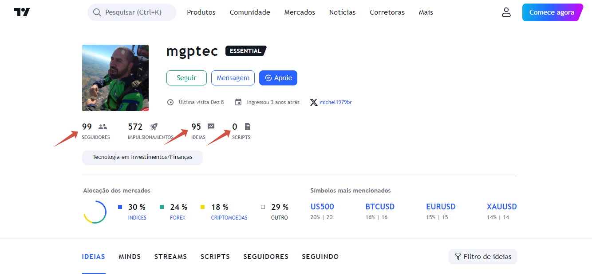
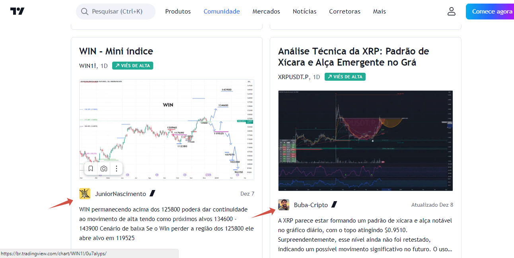
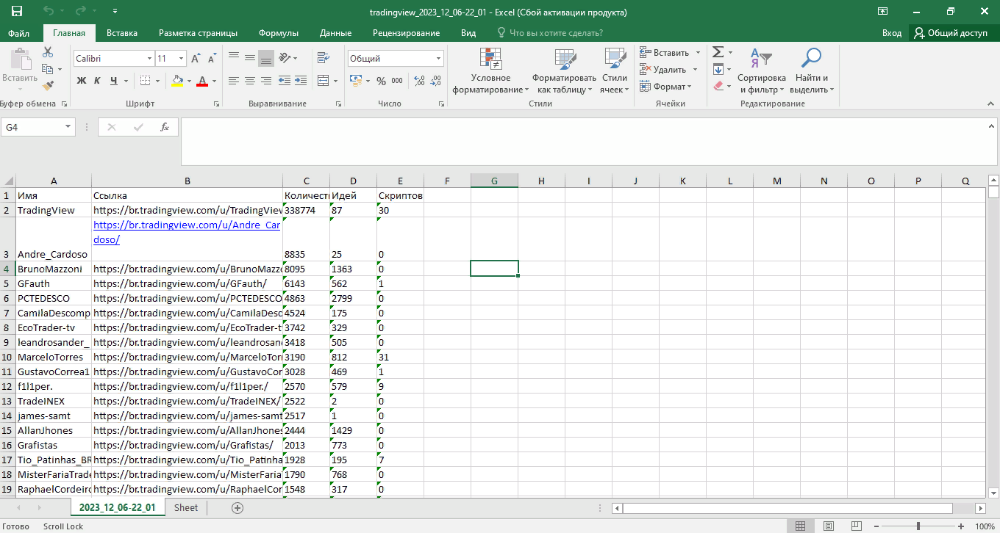

# scraping_tradingview

### Парсинг данных с использованием библиотек requests и Beautiful Soup

Задача была собрать данные популярных пользователей сайта br.tradingview.com

Решена путем сбора ссылок на пользоывателей через их посты с идеями.

Результат был сформирован в excel файл

